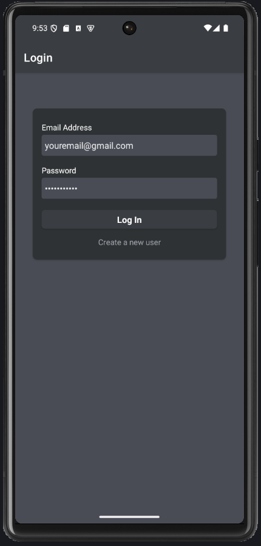
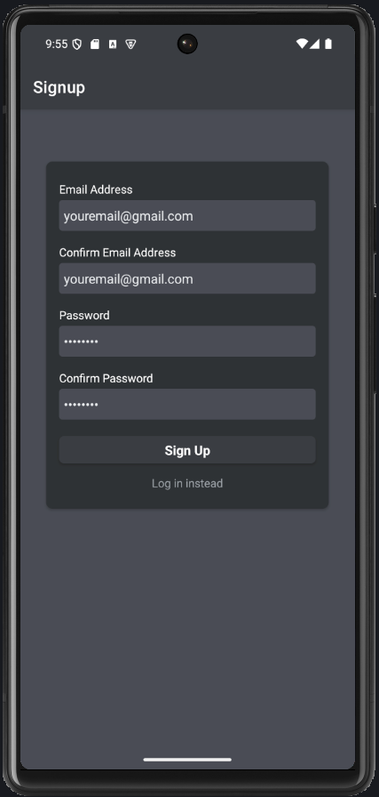
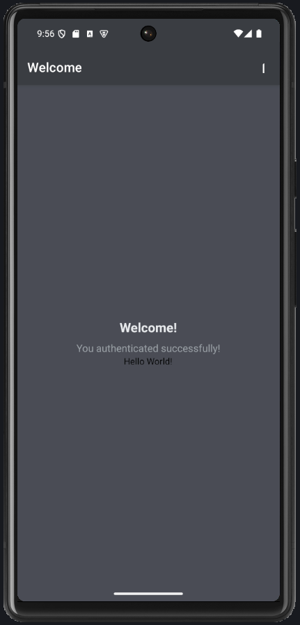

# React Native Authentication Template

A complete authentication template built with React Native, Expo, Redux Toolkit, and Firebase. This template provides a solid foundation for apps that require user authentication with login, signup, and secure session management.

## 🚀 Features

- **Complete Authentication Flow**: Login, Signup, and Logout functionality
- **Firebase Integration**: Secure authentication using Firebase Auth
- **Redux State Management**: Centralized state management with Redux Toolkit
- **Persistent Sessions**: Automatic login persistence using AsyncStorage
- **Input Validation**: Comprehensive form validation with error handling
- **Modern UI**: Clean and responsive user interface
- **Secure Token Management**: JWT token handling and storage
- **Protected Routes**: Route protection based on authentication status
- **Loading States**: Beautiful loading overlays during authentication
- **Error Handling**: User-friendly error messages and alerts

## 📱 Screenshots

|            Login Screen             |             Signup Screen             |             Welcome Screen              |
| :---------------------------------: | :-----------------------------------: | :-------------------------------------: |
|  |  |  |

## 🛠️ Tech Stack

- **React Native**: 0.79.5
- **Expo**: ~53.0.20
- **Redux Toolkit**: ^2.8.2
- **React Navigation**: ^7.1.14
- **Firebase**: Authentication API
- **AsyncStorage**: Session persistence
- **Axios**: HTTP client
- **React Native Vector Icons**: Icon components

## 📋 Prerequisites

Before running this project, make sure you have:

- Node.js (v16 or higher)
- npm or yarn
- Expo CLI
- Firebase project with Authentication enabled
- Android Studio (for Android development) or Xcode (for iOS development)

## ⚙️ Installation

1. **Clone the repository**

   ```bash
   git clone https://github.com/yourusername/react-native-auth-template.git
   cd react-native-auth-template
   ```

2. **Install dependencies**

   ```bash
   npm install
   ```

3. **Set up Firebase**

   - Create a new Firebase project at [Firebase Console](https://console.firebase.google.com/)
   - Enable Authentication and set up Email/Password sign-in method
   - Get your Firebase API key from Project Settings

4. **Environment Configuration**

   - Create a `.env` file in the root directory
   - Add your Firebase configuration:

   ```env
   FIREBASE_API_KEY=your_firebase_api_key_here
   ```

5. **Start the development server**
   ```bash
   npm start
   ```

## 🚀 Usage

### Running the App

```bash
# Start Expo development server
npm start

# Run on Android
npm run android

# Run on iOS
npm run ios

# Run on Web
npm run web
```

### Authentication Flow

1. **New Users**: Navigate to signup screen to create an account
2. **Existing Users**: Use login screen with email and password
3. **Auto-Login**: App automatically logs in users with valid stored tokens
4. **Logout**: Use the logout button in the welcome screen header

## 🏗️ Project Structure

```
AuthenticationTemplate/
├── components/
│   ├── Auth/
│   │   ├── AuthContent.js      # Main authentication container
│   │   ├── AuthForm.js         # Authentication form component
│   │   └── Input.js            # Custom input component
│   └── ui/
│       ├── Button.js           # Primary button component
│       ├── FlatButton.js       # Secondary button component
│       ├── IconButton.js       # Icon button component
│       └── LoadingOverlay.js   # Loading spinner overlay
├── constants/
│   └── styles.js               # Global color and style constants
├── screens/
│   ├── LoginScreen.js          # Login screen
│   ├── SignupScreen.js         # Signup screen
│   └── WelcomeScreen.js        # Protected welcome screen
├── store/
│   ├── authSlice.js            # Redux authentication slice
│   └── store.js                # Redux store configuration
├── util/
│   └── auth.js                 # Firebase authentication utilities
├── assets/                     # Images and screenshots
├── App.js                      # Main app component
└── package.json
```

## 🔧 Configuration

### Firebase Setup

1. **Authentication Methods**

   - Go to Firebase Console → Authentication → Sign-in method
   - Enable "Email/Password" provider

2. **Realtime Database (Optional)**
   - Set up Firebase Realtime Database for additional features
   - Update security rules as needed

### Environment Variables

Create a `.env` file with the following variables:

```env
FIREBASE_API_KEY=your_firebase_api_key
```

### Customization

#### Colors and Styling

Modify colors in `constants/styles.js`:

```javascript
export const Colors = {
  primary50: "#5c5e63be",
  primary100: "#4a4d55",
  primary500: "#3a3d43",
  primary800: "#2f3234",
  error100: "#4d3b3b",
  error500: "#c44569",
  accent: "#64b5f6",
  surface: "#3e4148",
  text: "#e8eaed",
  textSecondary: "#9aa0a6",
  border: "#5c6063",
};
```

#### Navigation

Navigation configuration is in `App.js`. You can modify screen options, headers, and navigation structure.

## 🔐 Security Features

- **Token Validation**: JWT tokens are validated on each app launch
- **Secure Storage**: Tokens are securely stored using AsyncStorage
- **Input Sanitization**: Email and password inputs are trimmed and validated
- **Error Handling**: Secure error messages without exposing sensitive information
- **Route Protection**: Authenticated routes are protected from unauthorized access

## 📦 Key Dependencies

| Package                                   | Version  | Purpose               |
| ----------------------------------------- | -------- | --------------------- |
| @reduxjs/toolkit                          | ^2.8.2   | State management      |
| @react-navigation/native                  | ^7.1.14  | Navigation            |
| @react-native-async-storage/async-storage | ^2.2.0   | Local storage         |
| axios                                     | ^1.10.0  | HTTP requests         |
| expo                                      | ~53.0.20 | Development platform  |
| react-native-dotenv                       | ^3.4.11  | Environment variables |

## 🐛 Troubleshooting

### Common Issues

1. **Metro bundler issues**

   ```bash
   npx react-native start --reset-cache
   ```

2. **Environment variables not loading**

   - Ensure `.env` file is in the root directory
   - Restart the development server after adding environment variables

3. **Firebase authentication errors**

   - Verify Firebase API key is correct
   - Check Firebase project configuration
   - Ensure Authentication is enabled in Firebase Console

4. **AsyncStorage issues on iOS**
   ```bash
   cd ios && pod install
   ```

## 🤝 Contributing

1. Fork the repository
2. Create a feature branch (`git checkout -b feature/amazing-feature`)
3. Commit your changes (`git commit -m 'Add some amazing feature'`)
4. Push to the branch (`git push origin feature/amazing-feature`)
5. Open a Pull Request

---
